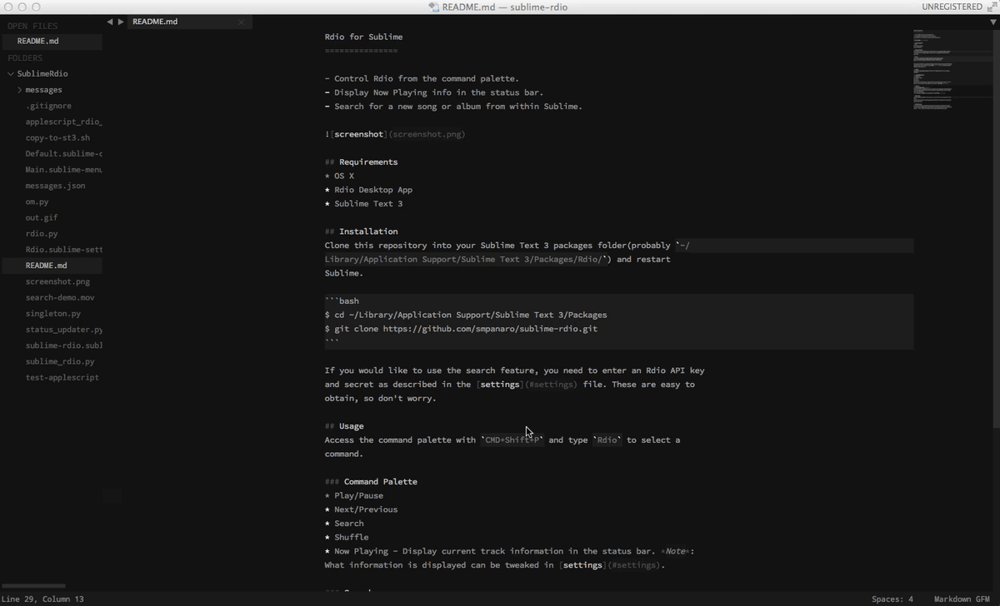

Rdio for Sublime
===============

- Control Rdio from the command palette. 
- Display Now Playing info in the status bar. 
- [Search](#search) for a new song or album from within Sublime.  


## Requirements
* OS X
* Rdio Desktop App
* Sublime Text 3

## Installation
Clone this repository into your Sublime Text 3 packages folder (probably `~/Library/Application Support/Sublime Text 3/Packages/Rdio/`) and restart Sublime.

```bash
$ cd ~/Library/Application\ Support/Sublime\ Text\ 3/Packages 
$ git clone https://github.com/smpanaro/sublime-rdio.git
```

If you would like to use the search feature, you need to enter an Rdio API key and secret as described in the [settings](#settings) file. These are easy to obtain, so don't worry.  

## Usage
Access the command palette with `CMD+Shift+P` and type `Rdio` to select a command.

### Command Palette
* Play/Pause
* Next/Previous
* Search
* Shuffle
* Now Playing - Display current track information in the status bar. *Note*: What information is displayed can be tweaked in [settings](#settings).

### Search
  
Access via the command palette. As you type a search suggestions will appear. Tab through them and hit enter to select one. Simply hit enter to perform a search without them.  
*Note*:Suggestions can be disabled in the [settings](#settings).  

## Settings
Settings can be found in `Sublime Text -> Preferences -> Package Settings -> Rdio`.  
Copy the contents of "Settings - Default" into "Settings - User" and edit as much as you want.  

## Acknowlegements
[rdio-simple](https://github.com/rdio/rdio-simple/tree/master/python) to interact with Rdio web API.  

## Known Issues
If this plugin launches the Rdio app and the user quits the app before the launch completes (when music starts playing), this plugin will launch the app again.  **FIX**: Wait for the app to fully launch before quitting.

## Bugs/Questions/Comments
Open an Issue or let me know [@flat](https://www.twitter.com/flat)