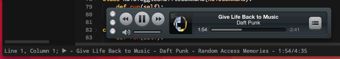

Rdio for Sublime
===============

Control Rdio from the command palette.

Requirements
------------
* OS X
* Rdio
* Sublime Text 2 or 3

Installation
-------
**The easy way**: Install [Package Control](https://sublime.wbond.net/installation). Bring up the Command Pallete. Select "Package Control: Install Package", and select Rdio after the list appears.

**The other way**: Clone this repository to `~/Library/Application Support/Sublime Text 2/Packages/Rdio/` or `~/Library/Application Support/Sublime Text 3/Packages/Rdio/` depending on your version of Sublime.

Usage
-----
Access the command palette with `CMD+Shift+P` and type `Rdio` to select a command.

Commands include:
* Play/Pause
* Next/Previous
* Search
* Repeat/Shuffle
* Now Playing

Settings can be found in `Sublime Text -> Preferences -> Package Settings -> Rdio`. 
